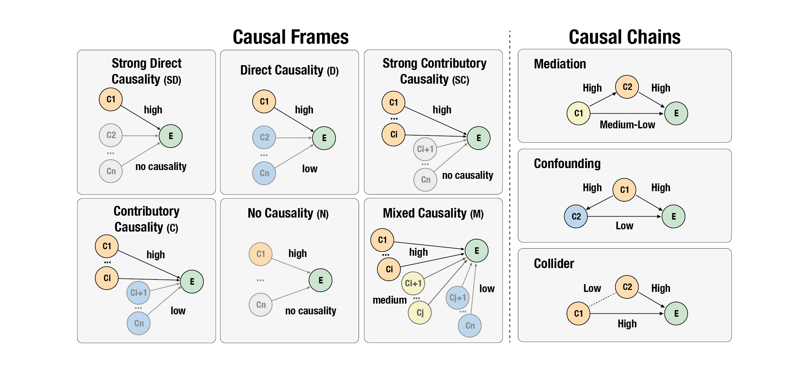

## 🦀 CRAB: Assessing the Strength of Causal Relationships Between Real-world Events

> Angelika Romanou, Syrielle Montariol, Debjit Paul, Leo Laugier, Karl Aberer, Antoine Bosselut
>
> [EPFL NLP Lab](https://nlp.epfl.ch/)

### 📄 [Paper](https://arxiv.org/abs/2311.04284) | 💻 [Code](https://github.com/agromanou/CRAB/tree/master/src) | 🦀 [Download data](https://drive.google.com/file/d/1brS0cLnnCWG2zDnPzRo1FXqCVlbPih_D/view?usp=sharing)

🦀 **CRAB** is a new **C**ausal **R**easoning **A**ssessment **B**enchmark designed to evaluate causal understanding of events in real-world narratives.


### Benchmark details

To construct 🦀 CRAB, we extracted real-world events from news articles covering newsworthy stories on various topics (Politics, Environment, etc.). We annotated the pair-wise causality scores between the events, creating causal graphs between events in these narratives.


> CRAB data pipeline overview: We collect documents covering newsworthy stories, create a timeline with the main events extracted from the documents for each story, and crowdsource human annotations on the causal judgments between the events. Based on these scores, we generate a causal graph for each story that can be filtered on different causal score thresholds. CRAB can also be viewed from the perspective of causal frames and causal chains (right). Same-color events originate from the same document.*


Peeking inside CRAB’s causal relationships, we included various causal reasoning structures. Each event in CRAB can be viewed as a contributory event in a causal frame and as a part of a complex causal chain. 


> Different structures of causal frames (left) and causal chains (right) present in CRAB. The patterns in structures are formulated based on the different causal judgment scores among events. The colors of cause-nodes represent the causality strength they have towards the event-node E.

### Performance of LLMs

Using 🦀 CRAB, we test LLM capabilities on Causal Discovery, Responsibility Assessment, and Multi-document Causal Reasoning. 


> Macro F1-scores on SoTA LLMs on all Pairwise Causality Inference tasks and the Graded Causality Inference MCQ. For the MCQ task, we stratify the results for in-doc and cross-doc based on whether the effect & correct cause are extracted from the same document.*

For more information on this benchmark, check our [paper](https://arxiv.org/abs/2311.04284).

## Citation
```
@inproceedings{romanou2023crab,
      title={CRAB: Assessing the Strength of Causal Relationships Between Real-world Events}, 
      author={Angelika Romanou and Syrielle Montariol and Debjit Paul and Leo Laugier and Karl Aberer and Antoine Bosselut},
      year={2023},
      eprint={2311.04284},
      archivePrefix={arXiv},
      primaryClass={cs.CL}
}
```